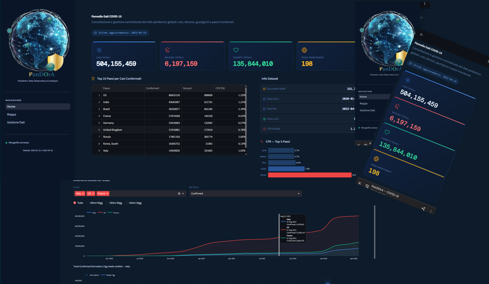
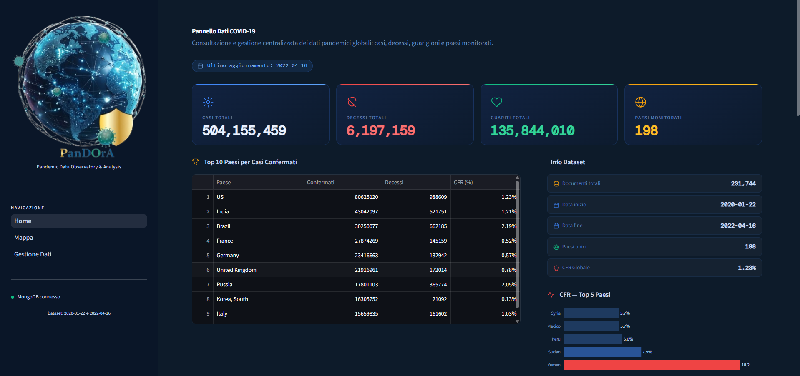
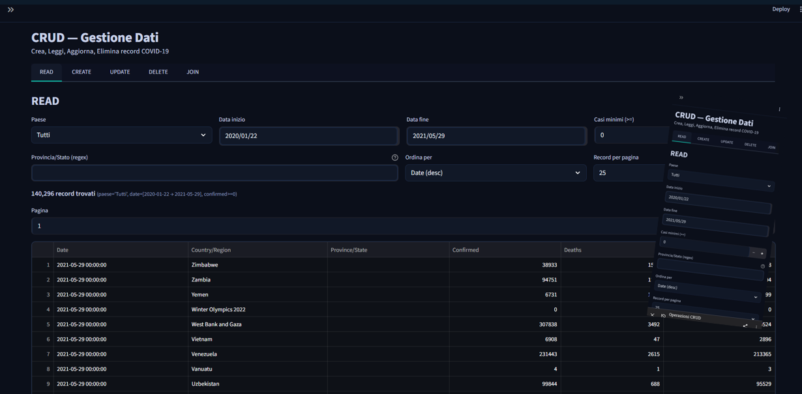
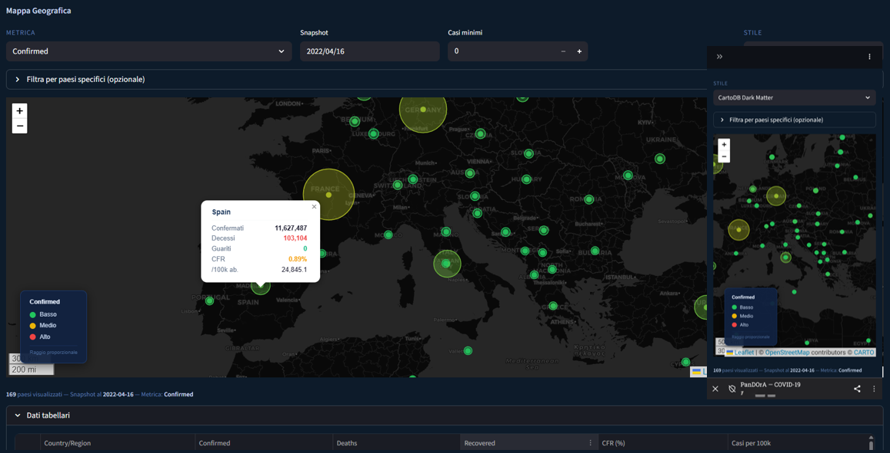

<div align="center">


</div>

<div align="center">

## Pandemic Data Observatory & Analysis 

</div>


Un'applicazione web interattiva per l'**analisi esplorativa** e la **gestione completa** dei dati COVID-19 a livello globale. Esplora trend pandemici, scopri pattern geografici e gestisci dati con operazioni CRUD avanzate, il tutto in una dashboard moderna e intuitiva.

**Tecnologie**: Streamlit • MongoDB • Plotly • Folium


---

## Indice

1. [Panoramica del progetto](#panoramica-del-progetto)
2. [Requisiti e installazione](#requisiti-e-installazione)
3. [Dataset](#dataset)
4. [Configurazione MongoDB](#configurazione-mongodb)
5. [Avvio dell'applicazione](#avvio-dellapplicazione)
6. [Pagine dell'applicazione](#pagine-dellapplicazione)
7. [Struttura del codice](#struttura-del-codice)
8. [Analisi esplorativa (EDA)](#analisi-esplorativa-eda)
9. [Autore](#autore)

---

## Panoramica del progetto

PanDOrA è un'applicazione multi-pagina Streamlit che permette di:

- **Visualizzare** i dati pandemici su una mappa interattiva Leaflet/OpenStreetMap
- **Analizzare** trend, KPI e classifiche tramite dashboard con grafici Plotly
- **Gestire** i dati con operazioni CRUD complete (Create, Read, Update, Delete)
- **Confrontare** le due collection dati tramite una JOIN (`$lookup` / `pd.merge`)
- **Esportare** report personalizzati in formato CSV
- **Importare** dati in bulk da file CSV

L'applicazione funziona in modalità duale:
- **Con MongoDB**: tutte le query sfruttano operatori nativi MongoDB (`find()`, `aggregate()`, `$lookup`, ecc.)
- **Senza MongoDB** (fallback): i dati vengono letti dai file CSV locali; le operazioni di scrittura sono disabilitate

---

## Requisiti e installazione

### Prerequisiti

- **Python** 3.9+
- **MongoDB** Community Server (opzionale — l'app funziona anche solo con CSV)
- **Ambiente conda** consigliato: `PANDORA`

### Installazione dipendenze

```bash
# Crea e attiva l'ambiente conda
conda create -n PANDORA python=3.11
conda activate PANDORA

# Installa tutte le dipendenze dal file requirements.txt
pip install -r requirements.txt
```

> **Nota**: Tutti i requisiti sono presenti nel file `requirements.txt` e vengono installati automaticamente con il comando precedente. 
---
## Dataset

### Sorgenti dati

| File | Formato | Righe | Descrizione |
|------|---------|-------|-------------|
| `csv/time-series-19-covid-combined.csv` | Long | ~231.746 | Tutti i paesi, una riga per data/paese/provincia |
| `csv/key-countries-pivoted.csv` | Wide/Pivot | ~818 | 8 paesi chiave, una colonna per paese |

---
## Configurazione MongoDB

### Import iniziale dei dati

Il file `connection.py` importa i CSV nelle collection MongoDB:

```bash
# Assicurati che MongoDB sia avviato
python connection.py
# Output: "Import completato :)"
```

Questo crea:
- **Database**: `nomeDB`
- **Collection `serie`**: ~231.746 documenti (da `time-series-19-covid-combined.csv`)
- **Collection `paesi`**: ~818 documenti (da `key-countries-pivoted.csv`)

### Connessione

```
Host: localhost
Porta: 27017
Database: nomeDB
Collection: serie, paesi
Timeout connessione: 2000ms
```

L'applicazione verifica la connessione automaticamente. Se MongoDB non è disponibile, viene mostrato un avviso e l'app funziona in modalità CSV.

---

## Avvio dell'applicazione

```bash
cd "c:\Users\..."
conda activate PANDORA
streamlit run app.py
```

L'applicazione si apre nel browser all'indirizzo `http://localhost:8501`.


---

## Pagine dell'applicazione

### <div align="center">1. Homepage - Pannello Dati COVID-19</div>

La pagina principale presenta un'interfaccia moderna con visualizzazione dei KPI globali:
- **Metriche principali**: Casi totali, Decessi totali, Guariti totali, Paesi monitorati
- **Tabella ranking**: Top 10 paesi per casi confermati
- **Metadati dataset**: Numero documenti, range di date, paesi unici
- **Stato connessione**: Indicatore visuale della connessione MongoDB



### <div align="center">2. CRUD - Gestione Dati Completa</div>

Pagina multi-tab per operazioni su database:
- **READ**: Ricerca avanzata con filtri, paginazione e ordinamento
- **CREATE**: Inserimento singolo e bulk da CSV
- **UPDATE**: Modifica record con conferma
- **DELETE**: Eliminazione con validazione
- **JOIN**: Confronto tra collection con pipeline MongoDB



### <div align="center">3. Mappa Interattiva - Visualizzazione Geospaziale</div>

Mappa mondiale con layer dinamici:
- **Cerchi proporzionali**: Dimensione e colore indicano intensità della metrica
- **Popup informativi**: Dettagli paese (confermati, decessi, CFR, incidenza)
- **Filtri sidebar**: Metrica, data snapshot, casi minimi, selezione paesi
- **Stili mappa**: Supporta Dark Matter, Positron, OpenStreetMap
- **Tabella interattiva**: Dati filtrati con esportazione CSV



---

## Struttura del codice

```
PanDOrA/
├── app.py                  # Homepage + configurazione Streamlit
├── connection.py           # Script import CSV → MongoDB
├── eda.py                  # Analisi esplorativa (genera grafici)
├── logoBD.png              # Logo dell'applicazione
│
├── csv/
│   ├── time-series-19-covid-combined.csv   # Dataset principale (231k righe)
│   └── key-countries-pivoted.csv           # Dataset pivotato (818 righe)
│
├── utils/
│   ├── __init__.py
│   ├── db.py               # Connessione MongoDB, dati statici, bulk load, CRUD write
│   ├── queries.py           # Tutte le query di lettura e aggregazione
│   └── styles.py            # Dark theme CSS + template Plotly
│
├── pages/
│   ├── 1_Mappa.py   # Mappa Leaflet/OpenStreetMap
│   ├── 2_Dashboard.py           # Grafici, KPI, JOIN visuale
│   └── 3_CRUD.py                # Operazioni crud
│
└──
```

---

## Analisi esplorativa (EDA)

```bash
python eda.py
```

I grafici vengono salvati nella cartella `analisi/`.

---

## Autore

Progetto universitario sviluppato da: **Grazia Di Pietro** - [GitHub](https://github.com/GracyDP)

---

*Ultimo aggiornamento: Maggio 2026*
